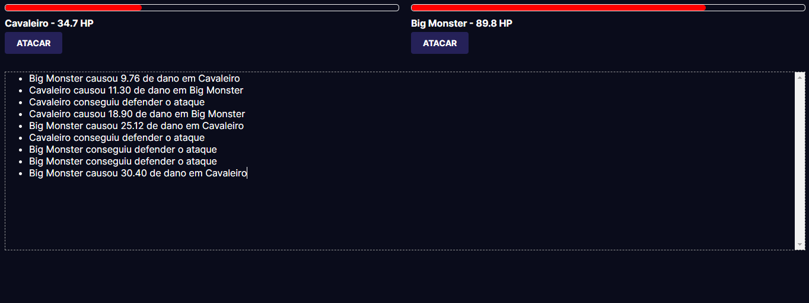

### Sobre o jogo

Este repositório contém o código para um jogo simples de luta desenvolvido utilizando classes em JavaScript. O jogo apresenta dois lutadores que se enfrentam em um combate. Cada lutador possui atributos como nome, vida e força de ataque, e pode realizar ações como atacar e defender.

### Pré-requisitos

Para executar o jogo, você precisará de um navegador web com suporte a JavaScript.

### Como Jogar

1. Acesse a página: https://fightmonster.vercel.app/

2. Siga as instruções na tela para jogar.

### Descrição do Jogo

O jogo consiste em duas fases:

**Fase 1: Seleção de Personagens**

O jogador escolhe um dos dois personagens disponíveis para jogar. Cada personagem possui atributos únicos, como nome, vida e força de ataque.

**Fase 2: Combate**

Os personagens se enfrentam em um combate turno a turno. O jogador controla as ações do seu personagem, escolhendo entre atacar ou defender. O ataque causa dano ao oponente, enquanto a defesa anlua o dano recebido. O combate termina quando um dos personagens perde toda a sua vida.

### Classes

O código do jogo utiliza classes para representar os personagens e suas ações. As classes definem os atributos e métodos dos personagens, como nome, vida, força de ataque, atacar e defender.

### Licença

Este repositório está licenciado sob a licença MIT.
